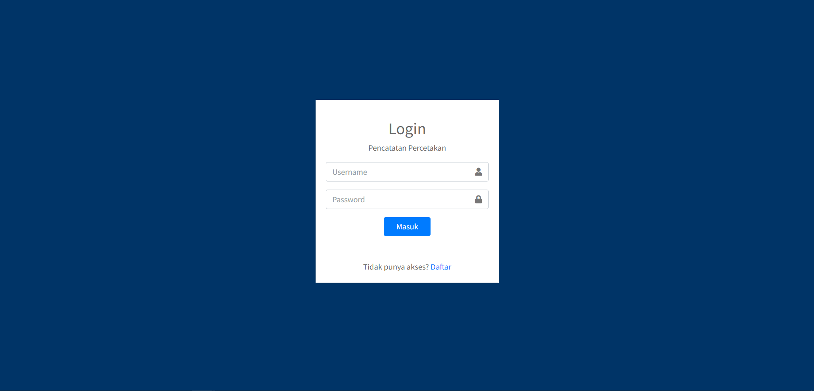
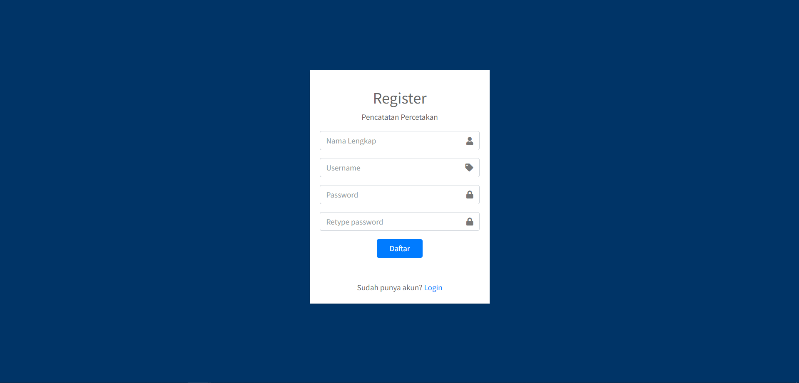
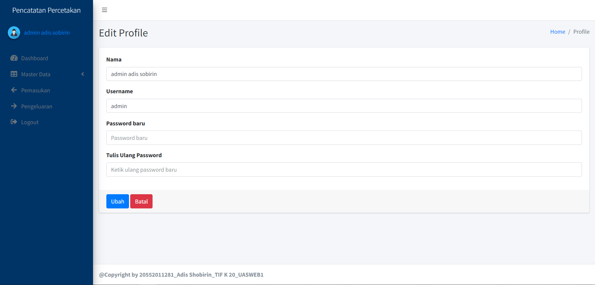
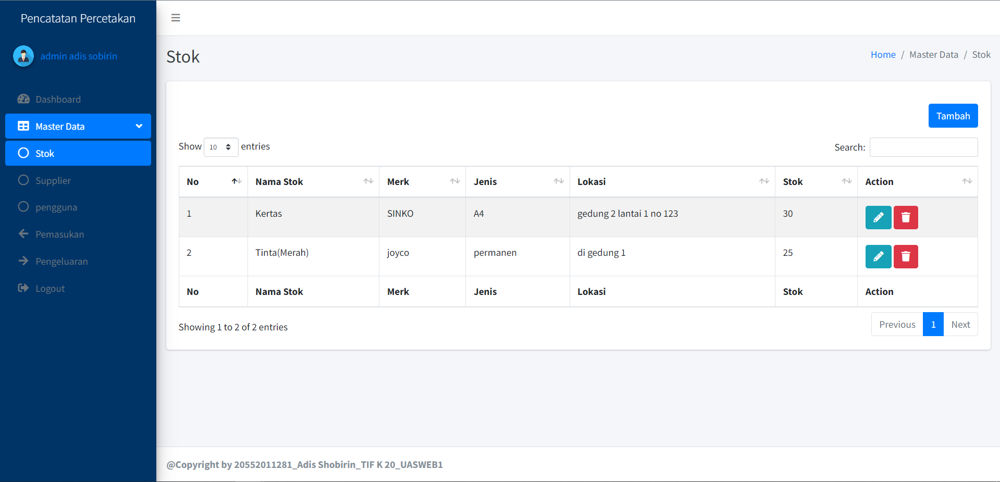
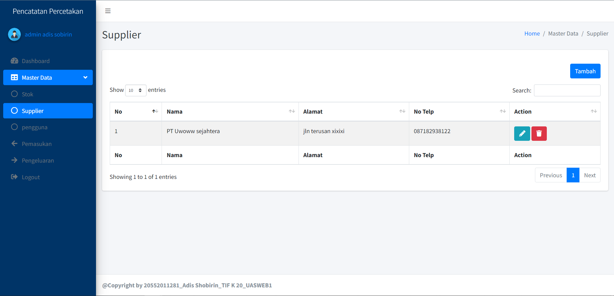
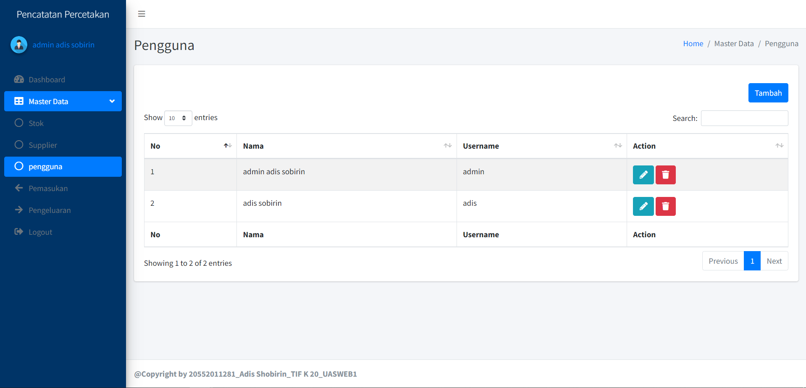
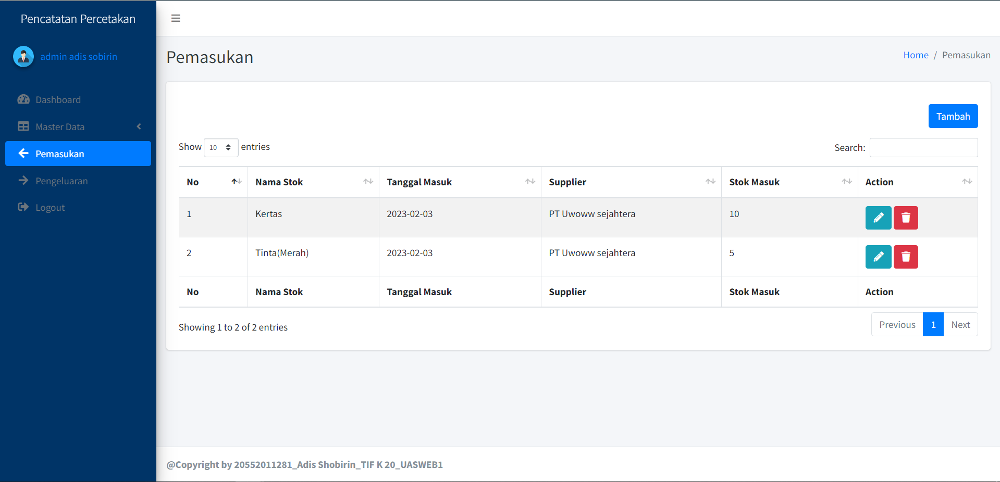
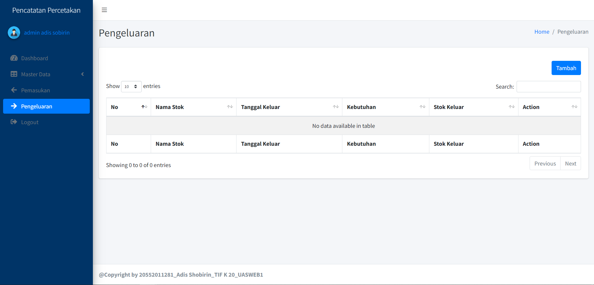

# Percetakan Informasi Sistem

Percetakan Informasi Sistem (PIS) merupakan sebuah sistem aplikasi dimana untuk melakukan pendataan bahan cetak baik yang masuk dan keluar, dengan PIS ini diharapkan proses pekerjaan khususnya di bagian logistik lebih efisien dan lebih menghemat waktu serta biaya.

project dibuat untuk memenuhi ujian akhir semester pada mata kuliah pemograman WEB I. 

Nama : Adis Shobirin 
NPM : 20552011281 
Kelas : TIF K 20

# Feature Aplikasi

- Halaman Login & Register

- Halaman Utama

- Halaman Master Data

- Halaman Pemasukan

- Halaman Pengeluaran

# Link Aplikasi (demo)
https://uasweb-adisshobirin-pencatatanpercetakan.000webhostapp.com/